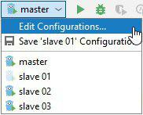
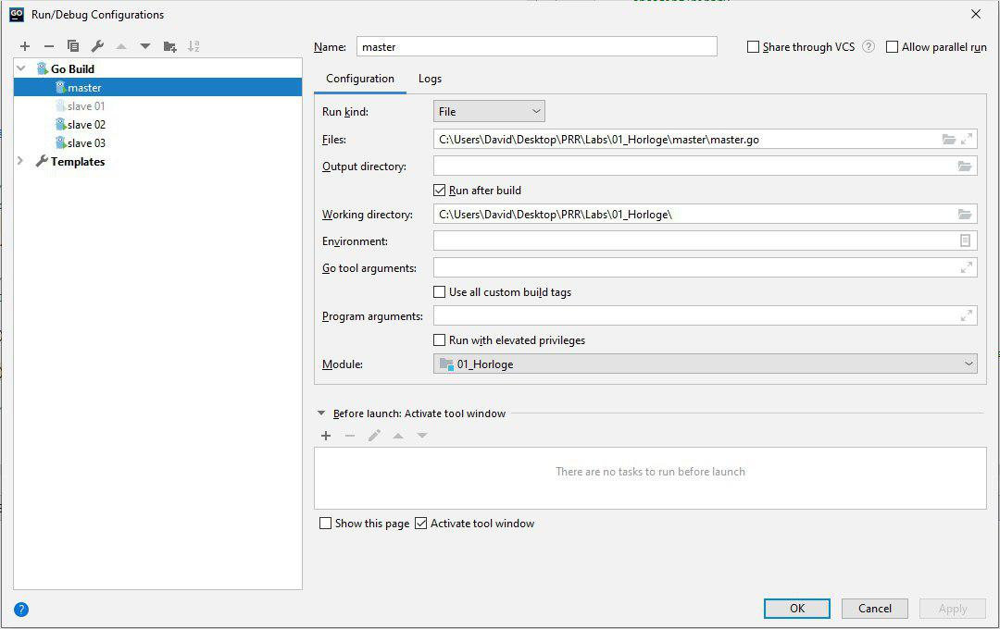

# PRR Laboratoire 1

Auteur : David Jaquet & Christoph Rouff soit Rueff

## Objectifs

- Écrire un premier programme de complexité moyenne en `Go` (`Golang`) et se familiariser avec un environnement de programmation `Go`
- Réaliser ses premières communications par UDP et par diffusion partielle (multicast)

## Énoncé du problème

Nous souhaitons implémenter un algorithme simple permettant de synchroniser approximativement les horloges locales des tâches d'une application répartie. Comme nous le savons, chaque site d'un environnement réparti possède sa propre horloge système, mais aussi, cette horloge a un décalage et une dérive qui lui est propre. Le but de notre algorithme est de rattraper ce décalage sans pour autant corriger l'horloge du système. Pour ce faire, nous distinguons 2 horloges. L'horloge système `hsys` est l'heure retournée par un appel système : cette horloge désigne la minuterie mise à jour par le système d'exploitation d'un site. Sous un système protégé, il faut avoir les privilèges administrateurs pour le modifier et, pour contourner ce problème, une tâche applicative peut interpréter le temps comme la valeur de l'horloge système sur le site où elle réside additionnée à un décalage. Dans ce qui suit, le résultat de cette opération est appelé l'horloge locale. Ainsi pour la tâche applicative `i`, nous avons : `hlocale(i) = hsys(site de i) + décalage(i)`.

La synchronisation des horloges revient alors à trouver `décalage(i)` pour chaque tâche i de telle sorte que `hlocale(i)` est identique pour toutes les tâches formant l'application répartie.

## Démarrer l'application

Pour démarrer l'application, il suffit d'exécuter un *maître* ainsi que un (ou des) *esclaves*. Pour se faire, il suffit d'exécuter les fichiers `master.go` et `slave.go`. Il est important de noter que l'ordre d'exécution des fichiers n'a pas d'importance et que, si nous voulons avoir plusieurs *esclaves*, il suffit d'exécuter plusieurs fois le fichier `slave.go`.

Si nous fermons le *maître* pendant qu'un (ou des) *esclave(s)* travaillent notre application est toujours fonctionnel, nos esclaves attendent des `DELAY_RESPONSE` pendant un éventuel délai artificiel paramétrable en plus de délai de 5 secondes que nous avons fixé arbitrairement. Si la requête n'est pas arrivé dans ce laps de temps, l'*esclave* continue passe à l'itération suivante. Il va donc renvoyer une requête `DELAY_REQUEST`.

### Utilisation avec un script Batch sous Windows

Nous avons également développé un script `Batch` très simple permettant d'exécuter l'application. Ici, nous partons du principe que la variable d'environnement `GOPATH` est déjà définie.

Pour exécuter ce script, il suffit de lancer le fichier `runApp.bat`. Une invite de commande s'ouvre et demande le nombre d'esclaves que l'utilisateur désire lancer. Par manque de connaissance et de temps, nous n'avons pas implémenté une vérification de saisie. Si l'utilisateur entre une mauvaise saisie, le script lancera uniquement l'application *maître*.

Cependant, si la saisie est correcte, le script lance un *maître* et le nombre d'*esclaves* désiré par l'utilisateur. Le *maître* ainsi que ses *esclaves* travaillent jusqu'à ce qu'on les arrête manuellement à l'aide d'un `ctrl + C` ou si on ferme l'invite de commande.

### Utilisation avec GoLand

Pour exécuter l'application avec le logiciel **GoLand**, il faut d'abord ajouter des configurations d'exécutions en cliquant sur *Edit Configurations...*, comme indiqué sur l'image ci-dessous. Il est important de noter que dans cette même image, nous avons déjà quatre configurations différentes (`master`, `slave 01`, `slave 02`, `slave 03`).

Ensuite, la *pop-up* suivante s'affiche. Dans cette image, la configuration est faite pour le fichier `master.go`. Il est évident que pour exécuter l'esclave, il faudra sélectionner le fichier `slave.go`. 

En dernier partie, on peut finalement exécuter nos fichiers grâce aux étapes suivantes :

1. Sélectionner la configuration `master`
2. Cliquer le bouton *play*
3. Sélectionner la configuration `slave 01`
4. Cliquer sur le bouton *play*

Si on veut plusieurs esclave, on peut répéter les numéros 3 et 4. Comme annoncé précédemment, l'ordre d'exécution des fichiers n'est pas important.

## Détail sur l'implémentation

Comme dit dans l'énoncé, nous avons implémenter le protocole `PTP`. Plusieurs choix d'implémentations ont été faits en fonction des informations sur le protocole que nous avons pu trouver sur la page [Wikipédia](https://fr.wikipedia.org/wiki/Precision_Time_Protocol) le décrivant. C'est le cas notamment pour fixer la valeur de la variable `k` décrite dans l'énoncé du laboratoire. En accord avec la page Wikipédia de `PTP`, cette valeur est fixée généralement à **2 secondes**.

### Fichier de configuration

Afin qu'il soit plus simple de gérer la configuration de l'application, nous avons implémenté un fichier de configuration au format `JSON`. Voici les variables contenues à l'intérieur de ce dernier :

| Variable           | Valeur par défaut | Remarques                                   |
| ------------------ | ----------------- | ------------------------------------------- |
| `multicast_addr`   | 224.0.0.1         | Adresse pour le multicast                   |
| `multicast_port`   | 6666              | Port pour le multicast                      |
| `srv_addr`         | 127.0.0.1         | Adresse pour la connexion UDP point à point |
| `srv_port`         | 8173              | Port pour la connexion UDP point à point    |
| `sync_delay`       | 2 [s]             | Délai de synchronisation (c'est le `k`)     |
| `simulation_delay` | 0 [ms]            | Simulation d'un délai                       |
| `simulation_gap`   | 0 [ms]            | Simulation d'un écart                       |

Grâce à notre fichier de configuration, on peut notamment simuler un délai ainsi qu'un écart. Cela permet notamment de tester notre implémentation sur un seul PC et d'être plus proche d'un cas d'utilisation réel.

### Format des requêtes

Les requêtes sont diffusés selon le format suivant : 

| Requête          | Format                    |
| ---------------- | ------------------------- |
| `SYNC`           | [`11`, `<id>`]            |
| `FOLLOW_UP`      | [`12`, `Tmaster`, `<id>`] |
| `DELAY_REQUEST`  | [`21`, `<id>`]            |
| `DELAY_RESPONSE` | [`22`, `Tmaster`, `<id>`] |

Les numéros au début du format de la requête correspondent à un `enum` dans lequel nous avons fixé les valeurs arbitrairement et qu'il soit stocké sur un octet. Le premier nombre correspond au numéro de l'étape et le deuxième correspond à l'ordre des requêtes.

- Première étape
  1. **SYNC** : 11
  2. **FOLLOW_UP** : 12
- Deuxième étape
  1. **DELAY_REQUEST** : 21
  2. **DELAY_RESPONSE** : 22

Comme notre but est d'envoyer le moins d'octet possible, nous avons décider d'avoir l'`id` stocké dans le format `byte`. Ainsi, l'envoi de ce dernier ne nécessite qu'un octet. Dans le langage `Go`

Le plus grand élément dans notre requête est le temps du *maître* (`Tmaster`) ce dernier est un temps en nanoseconde et nous avons donc besoin de 8 octets pour l'envoyer. Nos requêtes font donc soit 2 octets (`SYNC` et `DELAY_REQUEST`) soit 10 (`FOLLOW_UP` et `DELAY_RESPONSE`).

## Améliorations possibles

### Réduire le nombre d'octets des requêtes

Nous pouvons réduire le nombre d'octets nécessaires pour les requêtes `FOLLOW_UP` et `DELAY_RESPONSE`. Comme les plus grands groupes d'octets sont ceux pour stocker le temps, nous avons imaginer la possibilité de travailler avec des `millisecondes` au lieu des `nanosecondes` comme actuellement.

Cependant, nous avons obtenons donc un nombre de millisecondes égal à environ ‭`1'571'219'249'000‬ms`. Nous devons donc toujours les stocké sur 64 bits. Cela ne changerait donc pas le nombre d'octets nécessaire.

Par convention le temps généré à partir du 1er janvier 1970 à minuit. Nous pouvons donc réduire le temps en soustrayant une date arbitraire à celle de la convention. Nous avons regardé les valeurs que nous obtenions si nous faisons le calcul suivant `(t1 - t2) / 1'000'000` où `t1` correspond au temps en nanoseconde au 18 septembre 2019 à 14h55 (date de la distribution du laboratoire) et `t2` correspond au temps en nanoseconde au 1er janvier 1970 à minuit. La division sert à être en milliseconde.

Ce calcul nous donne un nombre de milliseconde égal environ à `‭2'403'893'000ms‬`. Ce nombre est stockable sur 32 bits et donc 4 octets. Nos requêtes `FOLLOW_UP` et `DELAY_RESPONSE` passeront donc de 10 octets à 6 octets.

Cette implémentation étant limité dans le temps avant de rencontré un `overflow`, nous avons choisi de garder les nanosecondes et nos 10 octets.

### Tests automatisés

Un autre améliorations possibles est l'ajout de tests automatisés. Malheureusement, nous n'en avons pas implémenté la possibilité d'avoir des tests automatisés par manque de temps et de connaissance du langage `Go`.